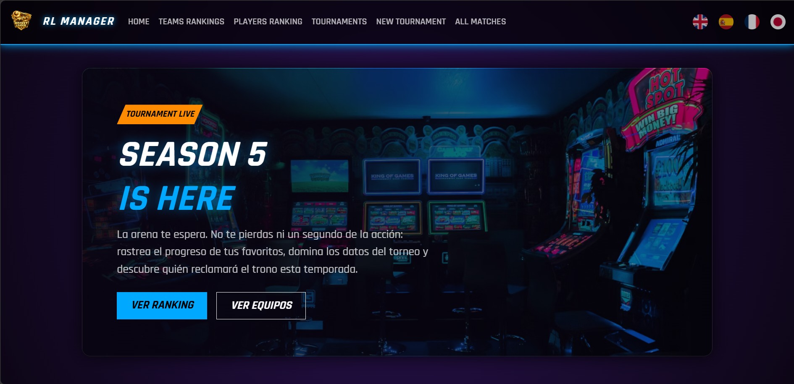
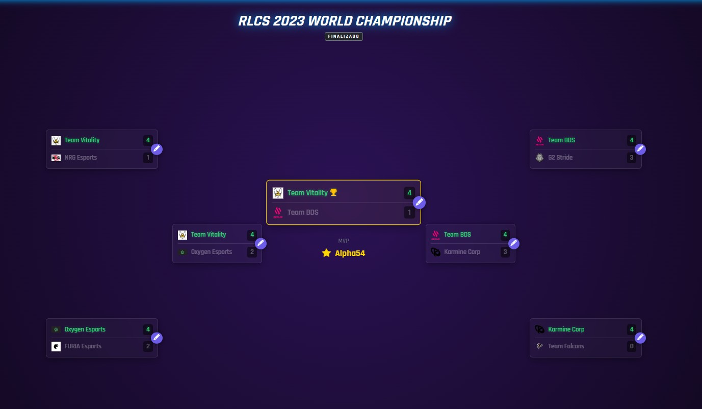
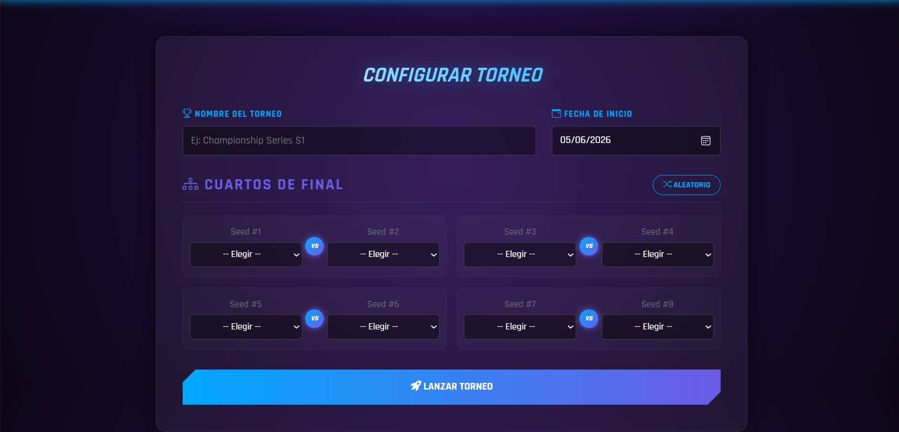
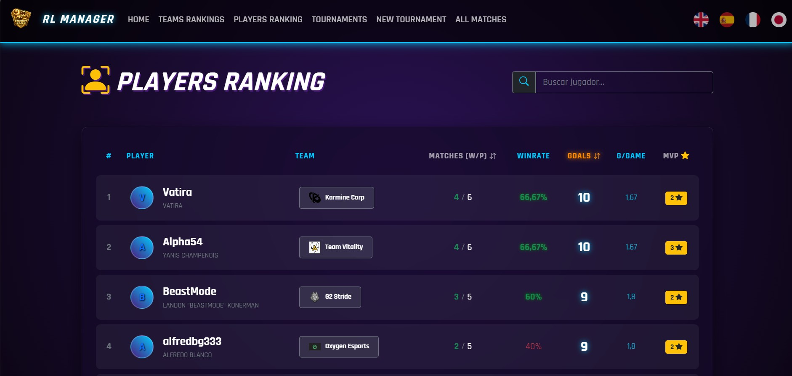
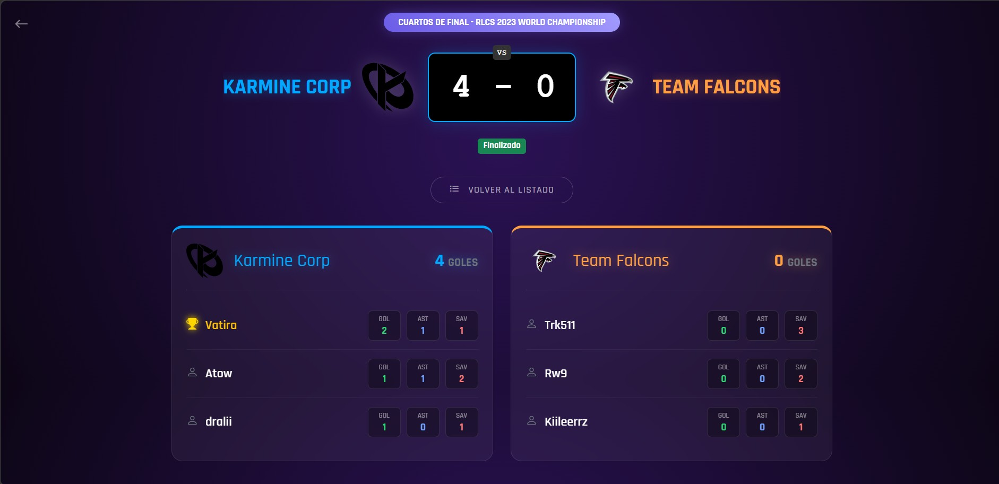

# RL-TournamentManager

RL-TournamentManager es una aplicación web diseñada para la gestión completa de torneos de Rocket League (u otros deportes electrónicos/tradicionales). Permite administrar de manera sencilla equipos, jugadores, torneos, rondas y partidos, así como hacer un seguimiento de los resultados y visualizar rankings.

## Tecnologías

- **Framework:** ASP.NET Core 8.0 (MVC)
- **Lenguaje:** C#
- **Base de Datos:** SQL Server con Entity Framework Core
- **Seguridad/Autenticación:** ASP.NET Core Identity
- **Frontend:** Razor Views, HTML, CSS, JavaScript

## Características

- **Gestión de Torneos:** Creación de torneos utilizando un asistente guiado (Wizard).
- **Gestión de Equipos y Jugadores:** Administración de la plantilla de jugadores y la formación de los equipos.
- **Encuentros y Rondas:** Organización estructurada de las competiciones en rondas y registro de los resultados de cada partido.
- **Rankings:** Visualización de la clasificación y desempeño de los participantes.
- **Control de Acceso:** Sistema de registro e inicio de sesión de usuarios.

## Capturas
## Inicio de la aplicación

## Ejemplo de un torneo

## Creación de torneo

## Lista de jugadores

## Ejemplo de partido

## Instalación

1- Clona el repositorio:
git clone <url-del-repositorio>
cd RL-TournamentManager

2-Restaura las dependencias:
dotnet restore

3-Verifica la cadena de conexión en TournamentManager/appsettings.json.

Por defecto el proyecto utiliza LocalDB:

"DefaultConnection": "Server=(localdb)\\MSSQLLocalDB;Database=TournamentManagerDB;Trusted_Connection=True;MultipleActiveResultSets=true"

4-Crea la base de datos y aplica las migraciones:
dotnet ef database update --project TournamentManager

5-Ejecuta la aplicación:
dotnet run --project TournamentManager

6-Abre el navegador en la URL indicada por la consola (normalmente https://localhost:xxxx).

## Arquitectura

El proyecto sigue el patrón de diseño arquitectónico **MVC (Model-View-Controller)** clásico de ASP.NET Core, organizado de la siguiente manera:

- **Models:** Contiene las clases de dominio o entidades (`Torneo`, `Equipo`, `Jugador`, `Partido`, `Ronda`, etc.) que representan la estructura de los datos y se mapean a las tablas de SQL Server mediante EF Core.
- **Views:** Archivos `.cshtml` (Razor) responsables de presentar la interfaz de usuario al navegador.
- **Controllers:** Clases como `TorneoController`, `EquipoController` o `RankingsController` que reciben las peticiones web, procesan la lógica de negocio apoyándose en los modelos y devuelven la vista adecuada.
- **Data/Migrations:** Carpeta dedicada a la configuración del contexto de la base de datos (Entity Framework) y los scripts de migración para el control de versiones del esquema de base de datos.
